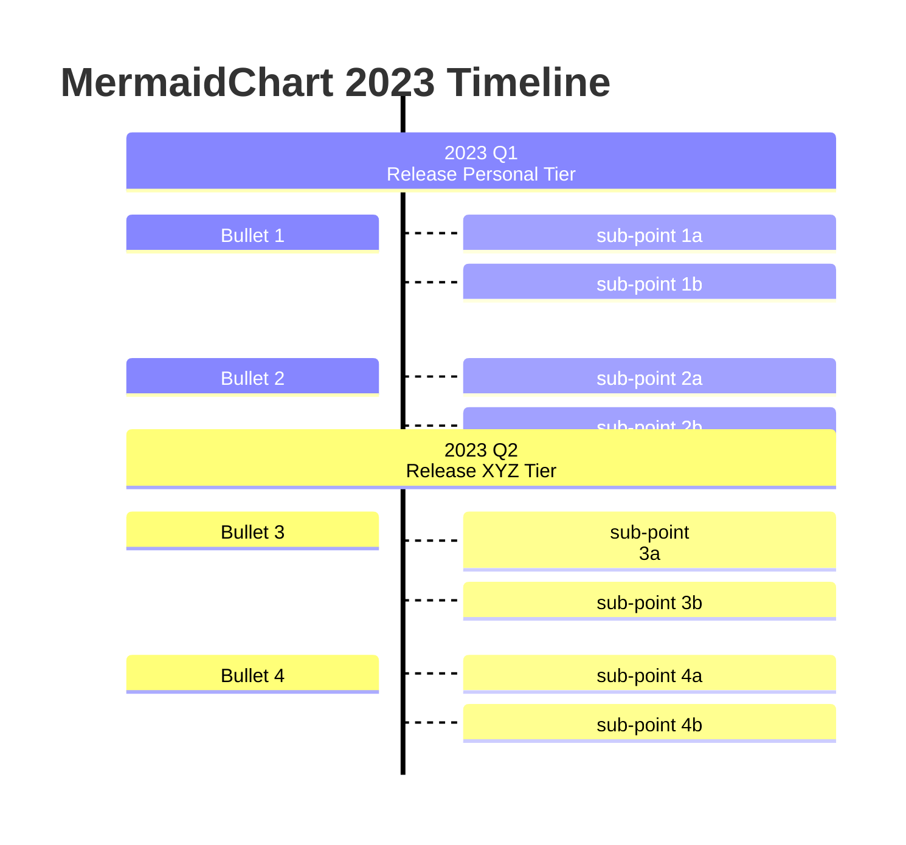

# Txt web

Chào mừng bạn đến với web được tạo bằng `README.md` và viết các tệp khác bằng văn bản thần túy (text file). 

## HOME|[ABOUT](./txt/about.txt)| 

Ở đây chưa có gì cả, nên tôi lấp đại khoảng trống bằng mấy dòng. 

### Chèn toán học:

Phương trình Dirac trong cơ học lượng tử: 

$$
(i \gamma^\mu \partial_\mu - m) \psi = 0
$$

### Chèn ảnh

.jpg)

Nhân vật Shimuda trong Shimeji Shimulation

### Mermaid 

### Chèn bảng 

|Tiêu đề 1|Tiêu đề 2|
|:--------|:--------|
|Nội dung 1|Nội dung 2|
|Nội dung 3|Nội dung 4|

<!-- Mathjax -->

