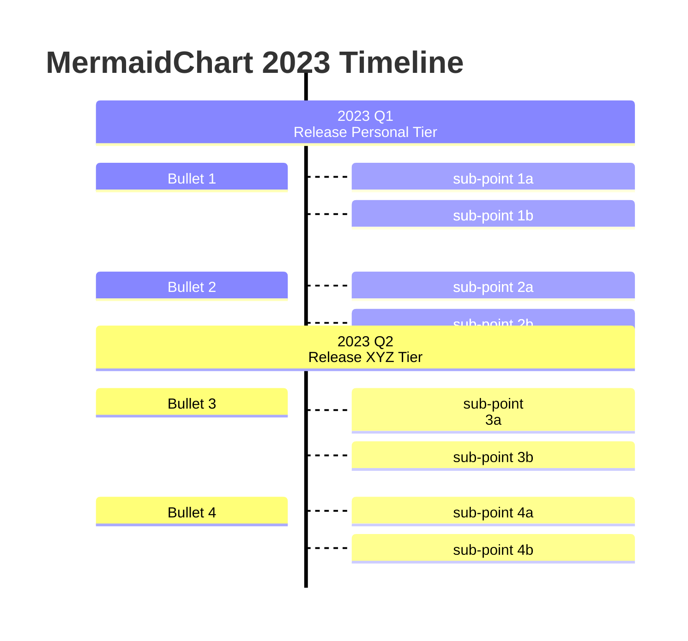

# Txt web

Chào mừng bạn đến với web được tạo bằng `README.md` và viết các tệp khác bằng văn bản thần túy (text file). 

## HOME|[ABOUT](./txt/about.txt)| 

Ở đây chưa có gì cả, nên tôi lấp đại khoảng trống bằng mấy dòng. 

### Chèn toán học:

Phương trình Dirac trong cơ học lượng tử: 

$$
\begin{equation}
(i \gamma^\mu \partial_\mu - m) \psi = 0
\end{equation}
$$

### Chèn ảnh

    
    Nhân vật Sumida trong bộ manga Shimeji Shimulation

### Mermaid 

